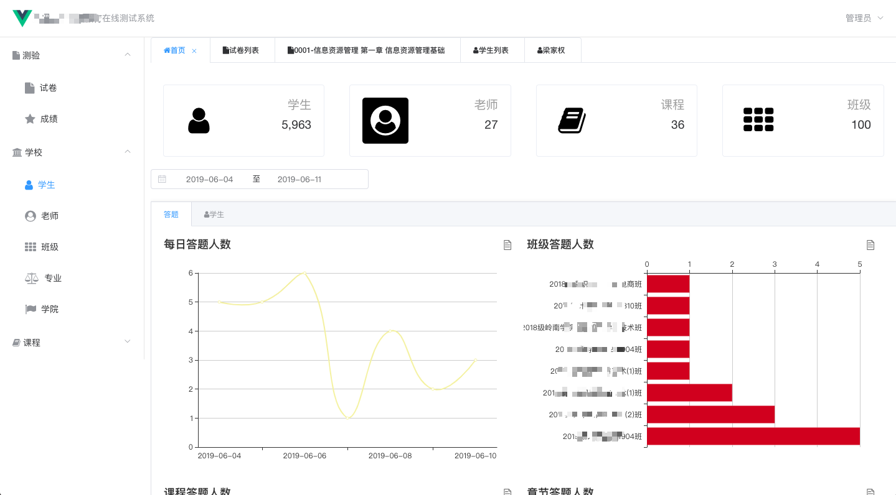
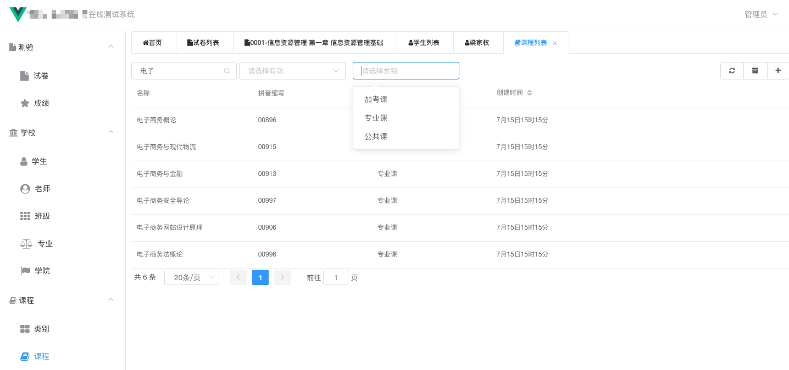

.. vue-django documentation master file, created by
   sphinx-quickstart on Tue Jun 11 10:11:33 2019.
   You can adapt this file completely to your liking, but it should at least
   contain the root `toctree` directive.

Welcome to vue-django's documentation!
======================================

本框架的目标是借鉴并超越django admin的自动化思想, 实现UI前端的极简快速定制开发.

快速预览
----------

首页仪表板

Model列表页

Model编辑页

.. image:: _static/img/example/model_edit.png

后台api接口标准使用django-restful-framework, 并作了部分扩展, 参见django_szuprefix项目.
前端MVVM框架使用vuejs, PC端控件库使用elementui, 移动端控件库使用vux.

项目当前实现的功能有:

    * model列表页自动排版

    * model编辑页自动排版,校验,提交,刷新

    * 菜单自动排版

Contents:

.. toctree::
   :maxdepth: 2

Indices and tables
==================

* :ref:`genindex`
* :ref:`modindex`
* :ref:`search`

